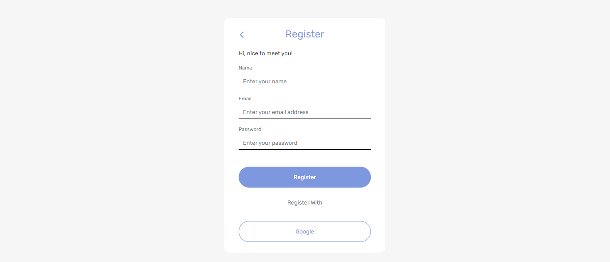

<div align="center">
  
</div>
<h3 align="center">Frontend Telegram Chat Apps</h3>
<p align="center">
  <a href="https://frontend-telegram-chat-apps.vercel.app/">View Demo</a>
</p>

<!-- ABOUT THE PROJECT -->
## About The Project

Telegram Chat Apps is a realtime web chat application with features to register, login, update profile, send message in real time, edit message, and delete message. This web application is built using ReactJS, ExpressJS, PostgreSQL, and WebSocket.

### Technology Used
- [ReactJS](https://reactjs.org/)
- [Redux](https://redux.js.org/)
- [Bootstrap](https://getbootstrap.com/)
- [Socket.IO](https://socket.io/)
- [Axios](https://github.com/axios/axios)
- [Moment](https://momentjs.com/)

<!-- GETTING STARTED -->
## Getting Started

### Installation
- Clone This Repository

`git clone https://github.com/rizkirnasution/Frontend-TelegramChatApps.git`

- Install Module

`npm install`

- Setting .env

```bash
REACT_APP_APP_NAME=YOUR_APP_NAME
REACT_APP_NODE_ENV=YOUR_CURRENT_ENVIRONMENT
REACT_APP_API_URL=YOUR_API_URL
```

### Executing program

- Run this project with `npm run start`.

<!-- SCREENSHOT -->
## Screenshot

### Login


### Register


### Home


### Edit Profile


### Chat


### Detail User


<!-- RELATED PROJECT -->
## Related Project

- [Backend Telegram Chat Apps](https://github.com/rizkirnasution/Backend-TelegramChatApps.git)
- [Backend Telegram Chat Demo](https://telegram-chat-be2-production.up.railway.app/)

<!-- CONTACT INFO -->
## Contact Info

Contributors names and contact info:

1. Rizki Romadhona Nasution

- [Linkedin](https://www.linkedin.com/in/rizkiromadhonanasution)

## License

This project is licensed under the MIT License - see the LICENSE file for details
